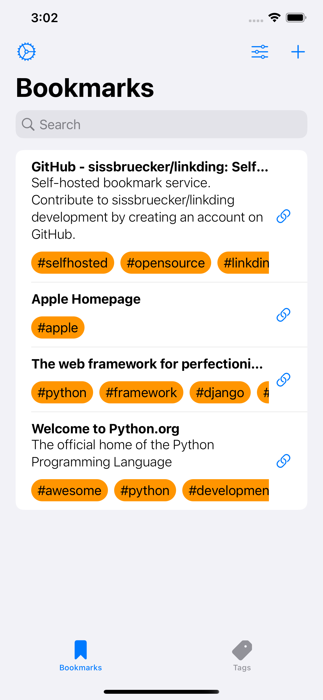
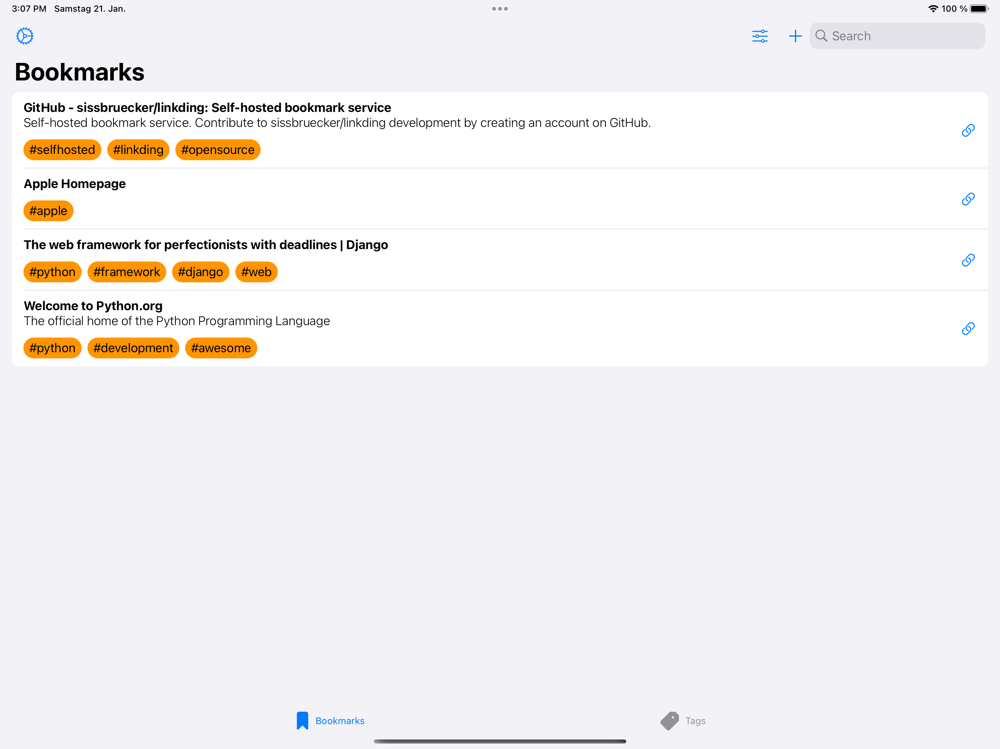

# Bookmark Companion

## Description

Bookmark Companion is your little helper to manage bookmarks from your self-hosted service.
You can add, modify and search your bookmarks while you are on the go. Create new bookmarks conveniently via the Share extension.

## Screenshots

 

## Build Project

Create a new file *Config.xcconfig* in the project root.
```
// Configuration settings file format documentation can be found at:
// https://help.apple.com/xcode/#/dev745c5c974
DEVELOPMENT_TEAM =
```
After that you can just compile & run the project with XCode.

## Documentation

* [New App Releases](Docs/Release.md)

## AppStore

You can support development of the project by using the Version available on the AppStore.

[](https://apps.apple.com/us/app/bookmarkcompanion/id6444032742)

## License

* [MIT License](LICENSE.md)
